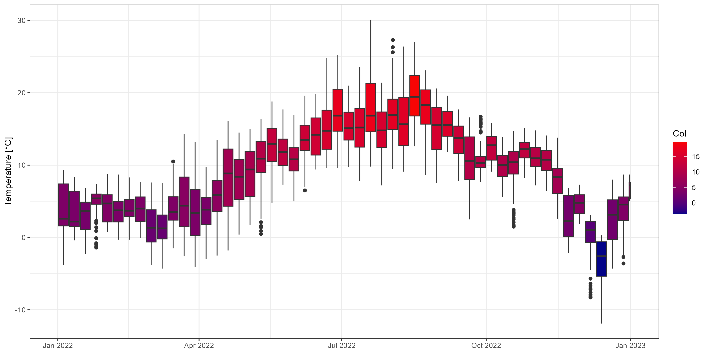

# Access DMI via API #

This document provides instructions on how to utilise the Application Programming Interface (API) to access data from the Danish Meteorological Institute (DMI) using the R statistical computing software. It includes illustrative examples for the meteorological observations *(Observationsdata)* and the climate data *(Klimadata)*.

At the time I wrote the first version of this guide (August 2024), there was no detailed information on DMI. Now, they have their on guides that are quite detailed and makes this one a bit obsolete.

## Getting started ##

### User creation ###

Prior to initiating the download of data via the API, it is necessary to complete the following steps:
  1. Register as a user in DMI's [Developer Portal](https://dmiapi.govcloud.dk/#!/).
  2. Register an application in the developer portal and obtain an API key.
  3. Save the key in a secure location, as it will be required each time a request is made to the API. In the absence of these prerequisites, the API will not authorise the user. Further information can be found on the [User Creation page](https://opendatadocs.dmi.govcloud.dk/en/Authentication).
  4. It is necessary to create distinct API keys for each application. It is not possible to utilise a single API key for both observational/station data and climate data (grid data). It is recommended to save the purpose of each API key with the key itself. 


### R packages ###

The following `R` libraries are required to make the requests:

  - `httr`: Needed to make a request
  - `jsonlite`: Needed to read files

  Further, I recommend using the package
  - `data.table`: It is an excellent package for large data manipulation. This is not really necessary, but I highly recommend it.

  ```R
  install.packages(c('httr', 'jsonlite', 'data.table'))

  library(httr)
  library(jsonlite)
  library(data.table)
  ```

## Station information ##

The meteorological observation (metObs) API service contains besides [raw weather observation data](#meteorological-observation-data) also information about the different stations that are available on DMI. This is useful, if you wanna see what stations are available within a certain area, or what kind of parameters are logged at certain stations.

### Input list ###

There are different [queries](https://opendatadocs.dmi.govcloud.dk/en/APIs/Meteorological_Observation_API#collections) you can use to make your request. Here are the most important queries:
 - `API-key` - This is always necessary. You need an API specific for this purpose.
 - `url` - This is always necessary. There are different urls for different base requests.
 - `bbox` - This is useful if you wanna select stations in a certian area. The query is southwest corner and northeast corner i.e., `LON1, LAT1, LON2, LAT2`. An easier approach would be just looking at the [map](https://www.dmi.dk/friedata/observationer/) (or [here](https://www.dmi.dk/vejrdata/maalinger) in case the previous link does not work). If you have a `stationId` defined, there is no need for `bbox`.
 - `stationId` - This is used if you wanna have data from only a certain station. The station ID can either be found with a basic request, the  or on the [map](https://www.dmi.dk/friedata/observationer/) or the [DMI station list](https://opendatadocs.dmi.govcloud.dk/Data/Meteorological_Observation_Data_Stations).
 

### Request data ###

For a better overview of your code, I suggest assigning the different queries to variables. Except from the urls, the queries will have the following structure in the request `'query_name=your_input'`. If you narrow down your request with multiple queries, they will be separated by `&`.
```R
API <- 'api-key=12345-6789-abcd-efgh-987654321' # This is an example API key.
url <- 'https://dmigw.govcloud.dk/v2/metObs/collections/station/items?' # The url needed to access station information.
stationId <- paste0('stationId=', '06060')
bbox <- paste0('bbox=', '9.52,56.44,9.62,56.52')
```

#### Make a base request ####

```R
GET(paste(url, API, sep = '&'))
```
```HTML
Response [https://dmigw.govcloud.dk/v2/metObs/collections/observation/items?&api-key=12345-6789-abcd-efgh-987654321]
  Date: 2025-11-19 10:33
  Status: 200
  Content-Type: application/json
  Size: 546 kB
```  
You should get a status code `200`, indicating a successful request. If you get another code then there is something wrong. Check this [website](https://www.restapitutorial.com/httpstatuscodes.html) to figure out what your status code means.

Use the `fromJSON()` function to make the response readable:
```R
station_raw <- GET(paste(url, API, sep = '&'))
station_info <- fromJSON(rawToChar(station_raw$content))
```
Your output should look more or less like this. Note, that for the purpose of a better overview, I changed a bit the display of `$features`. 
```HTML
$type
[1] "FeatureCollection"

$features
        type                                   id geometry.type geometry.coordinates  properties.owner properties.country properties.anemometerHeight properties.wmoCountryCode properties.operationFrom                                                                                         properties.parameterId   properties.created properties.barometerHeight properties.validFrom properties.type properties.stationHeight properties.regionId   properties.name properties.wmoStationId properties.operationTo properties.updated properties.stationId   properties.validTo properties.status
  1 Feature 46d09e86-8053-f1e6-f765-e15021297cab         Point       4.2719,56.3442 Havne Kommuner mv                DNK                          NA                      6080     2012-05-01T00:00:00Z                                                 cloud_height,pressure,temp_dew,temp_dry,visibility,weather,... 2025-06-23T06:18:29Z                         NA 2012-05-01T00:00:00Z           Synop                  999.000                   6          Harald B                   06018                   <NA>                 NA                06018 2023-10-25T09:48:08Z            Active
  2 Feature f19dea2f-dc94-2a19-919a-2eb592626891         Point       4.2719,56.3442 Havne Kommuner mv                DNK                          NA                      6080     2012-05-01T00:00:00Z                                                 cloud_height,pressure,temp_dew,temp_dry,visibility,weather,... 2025-06-23T06:18:29Z                         NA 2023-10-25T09:48:08Z           Synop                 -999.000                   6          Harald B                   06018                   <NA>                 NA                06018 2023-10-26T07:09:52Z            Active
  3 Feature 19e64c5a-68ce-51f3-5e8f-d22fb54d3d24         Point       4.2719,56.3442 Havne Kommuner mv                DNK                          NA                      6080     2012-05-01T00:00:00Z                                                 cloud_height,pressure,temp_dew,temp_dry,visibility,weather,... 2025-06-23T06:18:29Z                      25.20 2023-10-26T07:09:52Z           Synop                   46.330                   6          Harald B                   06018                   <NA>                 NA                06018                 <NA>            Active
  4 Feature a1bb563b-865f-298b-22eb-5a545dedbd40         Point       8.6412,56.9300               DMI                DNK                          NA                      6080     2002-03-22T00:00:00Z humidity,humidity_past1h,leav_hum_dur_past10min,leav_hum_dur_past1h,precip_dur_past10min,precip_dur_past1h,... 2025-06-23T06:18:29Z                         NA 2002-03-22T00:00:00Z           Synop                   42.000                   6          Silstrup                   06019                   <NA>                 NA                06019 2019-01-30T15:20:15Z            Active
  5 Feature d6a436c9-bd9e-2d22-dd3e-836e1f60b31d         Point       8.6412,56.9300               DMI                DNK                          10                      6080     2002-03-22T00:00:00Z humidity,humidity_past1h,leav_hum_dur_past10min,leav_hum_dur_past1h,precip_dur_past10min,precip_dur_past1h,... 2025-06-23T06:18:29Z                         NA 2019-01-30T15:20:15Z           Synop                   42.000                   6          Silstrup                   06019                   <NA>                 NA                06019                 <NA>            Active
 ---                                                                                                                                                                                                                                                                                                                                                                                                                                                                                                                                                                                                     
635 Feature dbe54b7d-9673-cca0-53d0-d7bfbe1eac3c         Point      -6.5766,62.2178 Havne Kommuner mv                FRO                          NA                      6080     2009-05-18T00:00:00Z                                 cloud_cover,cloud_height,humidity,humidity_past1h,pressure,pressure_at_sea,... 2025-06-23T06:18:29Z                         NA 2020-12-14T14:18:31Z           Synop                   80.000                   6 Klaksvik Heliport                   06013                   <NA>                 NA                06013 2024-11-22T13:54:41Z            Active
636 Feature db8b6123-e688-bf23-92db-eb18c7366f4a         Point      -6.5766,62.2178 Havne Kommuner mv                FRO                          NA                      6080     2009-05-18T00:00:00Z                                 cloud_cover,cloud_height,humidity,humidity_past1h,pressure,pressure_at_sea,... 2025-06-23T06:18:29Z                         NA 2024-11-22T13:54:41Z           Synop                   80.162                   6 Klaksvik Heliport                   06013                   <NA>                 NA                06013                 <NA>            Active
637 Feature fed97669-73f4-60ca-4282-a3f833c47ab2         Point      -7.0740,62.2995 Havne Kommuner mv                FRO                          NA                      <NA>     2022-05-25T00:00:00Z                           humidity,humidity_past1h,precip_past10min,precip_past1h,pressure,pressure_at_sea,... 2025-06-23T06:18:29Z                     174.00 2022-05-25T00:00:00Z           Synop                  176.400                <NA>              Eioi                    <NA>                   <NA>                 NA                06014 2024-05-28T07:51:28Z            Active
638 Feature dd576007-938c-1d65-dc72-4e75d94d4620         Point      -7.0740,62.2995 Havne Kommuner mv                FRO                          NA                      <NA>     2022-05-25T00:00:00Z                           humidity,humidity_past1h,precip_past10min,precip_past1h,pressure,pressure_at_sea,... 2025-06-23T06:18:29Z                     177.36 2024-05-28T07:51:28Z           Synop                  176.500                <NA>              Eioi                    <NA>                   <NA>                 NA                06014 2024-06-14T08:51:00Z            Active
639 Feature 48df3aba-c1bd-4627-67b3-0070eb0ffcdd         Point      -7.0740,62.2995 Havne Kommuner mv                FRO                          NA                      <NA>     2022-05-25T00:00:00Z                           humidity,humidity_past1h,precip_past10min,precip_past1h,pressure,pressure_at_sea,... 2025-06-23T06:18:29Z                     177.36 2024-06-14T08:51:00Z           Synop                  176.500                <NA>              Eidi                    <NA>                   <NA>                 NA                06014                 <NA>            Active

$timeStamp
[1] "2025-11-19T10:35:00Z"

$numberReturned
[1] 639

$links
                                                                                                                   href  rel                 type               title
1            https://dmigw.govcloud.dk/v2/metObs/collections/station/items?api-key=12345-6789-abcd-efgh-987654321 self application/geo+json       This document
2 https://dmigw.govcloud.dk/v2/metObs/collections/station/items?api-key=12345-6789-abcd-efgh-987654321&offset=639 next application/geo+json Next set of results
```

In `station_info$features` there is all the necesary info saved. The station ID can be found under `station_info$features$properties$stationId`. If you wanna check the parameters available for a certain station e.g., `06074`, then I recommend using a data.table.
```R
dt <- as.data.table(station_info$features$properties)
dt[stationId == '06074']
```
There are four entries with that station. We are only interested in the one still running
```R
dt[stationId == '06074' & is.na(validTo), unlist(parameterId)]
```
The output should look like this
```HTML
> dt[stationId == '06074' & is.na(validTo), unlist(parameterId)]
 [1] "cloud_cover"              "cloud_height"             "humidity"                 "humidity_past1h"          "precip_dur_past10min"     "precip_dur_past1h"       
 [7] "precip_past10min"         "precip_past1h"            "pressure"                 "pressure_at_sea"          "temp_dew"                 "temp_dry"                
[13] "temp_max_past12h"         "temp_max_past1h"          "temp_mean_past1h"         "temp_min_past12h"         "temp_min_past1h"          "visib_mean_last10min"    
[19] "visibility"               "weather"                  "wind_dir"                 "wind_dir_past1h"          "wind_gust_always_past1h"  "wind_max"                
[25] "wind_max_per10min_past1h" "wind_min"                 "wind_min_past1h"          "wind_speed"               "wind_speed_past1h" 
```

## Meteorological observation data ##

The meteorological observation (metObs) API service contains besides [station information](#station-information) meteorological observation data e.g., wind, temperature, and precipitation. You can read more about meteorological observations and how they are attained under [data information](https://opendatadocs.dmi.govcloud.dk/en/Data/Meteorological_Observation_Data).

If you want to download large quantities of historical meteorological observation data, DMI recommends that you use thier bulk download service. In this guide I do not (yet) cover the bulk request (I just use a loop).

### Input list ###

There are different [queries](https://opendatadocs.dmi.govcloud.dk/en/APIs/Meteorological_Observation_API#collections) you can use to make your request. Here are the most important queries:
 - `API-key` - This is always necessary.
 - `url` - This is always necessary. You need an API specific for this purpose.
 - `stationId` - This is used if you wanna have data from only a certain station. The station ID can either be found with a [basic request](#station-information) with the station url or on the [DMI station list](https://opendatadocs.dmi.govcloud.dk/Data/Meteorological_Observation_Data_Stations).
 - `datetime` - With this you can define the time range of the data. Different formats are possible. More information in the documentation linked above.
 - `parameterId` - Define which parameter you need. Below, is a list (actually a vector) of all possible parameters.
 - `limit` - Define how many rows/entries you need. The default is 1,000 and the maximum is 300,000.
 - `bbox` - This is useful if you wanna select stations in a certian area. The query is southwest corner and northeast corner i.e., `LON1, LAT1, LON2, LAT2`. Otherwiese, just look at the [map](https://www.dmi.dk/friedata/observationer/) (or [here](https://www.dmi.dk/vejrdata/maalinger) in case the previous link does not work). If you have a `stationId` defined, there is no need for `bbox`.

List of all available parameterIds:
```R
parameterId_vec <- c("temp_dry", "temp_dew", "temp_mean_past1h", "temp_max_past1h", "temp_min_past1h", "temp_max_past12h", "temp_min_past12h",
  "temp_grass", "temp_grass_max_past1h", "temp_grass_mean_past1h", "temp_grass_min_past1h", "temp_soil", "temp_soil_max_past1h",
  "temp_soil_mean_past1h", "temp_soil_min_past1h", "humidity", "humidity_past1h", "pressure", "pressure_at_sea", "wind_dir", "wind_dir_past1h",
  "wind_speed", "wind_speed_past1h", "wind_gust_always_past1h", "wind_max", "wind_min_past1h", "wind_min", "wind_max_per10min_past1h",
  "precip_past1h", "precip_past10min", "precip_past1min", "precip_past24h", "precip_dur_past10min", "precip_dur_past1h", "snow_depth_man",
  "snow_cover_man", "visibility", "visib_mean_last10min", "cloud_cover", "cloud_height", "weather", "radia_glob", "radia_glob_past1h",
  "sun_last10min_glob", "sun_last1h_glob", "leav_hum_dur_past10min", "leav_hum_dur_past1h")
```

#### Make a request ####

For a better overview of your code, I suggest assigning the different queries to variables. Except from the urls, the queries will have the following structure in the request `'query_name=your_input'`. If you narrow down your request with multiple queries, they will be separated by `&`.
In this example, I request temperature data (`temp_dry`) for the station Århus Syd (stationId = 06074) for the time 01. April 2023 00:00:00 to 30. April 2023 04:00:00.
```R
API <- 'api-key=12345-6789-abcd-efgh-987654321' # this is just a random API key I made up.
url <- 'https://dmigw.govcloud.dk/v2/metObs/collections/observation/items?' # url for accessing observational data
stationId <- paste0('stationId=', '06074')
datetime <- paste0('datetime=', '2023-04-01T00:00:00Z/2023-04-30T04:00:00Z')
parameterId <- paste0('parameterId=', 'temp_dry')
limit <- paste0('limit=', '300000')
```
Make a request with all the queries and assign it to a new variable
```R
GET(paste(url, stationId, datetime, parameterId, limit, API, sep = '&'))
```
```HTML
Response [https://dmigw.govcloud.dk/v2/metObs/collections/observation/items?&api-key=12345-6789-abcd-efgh-987654321]
  Date: 2025-11-24 14:07
  Status: 200
  Content-Type: application/json
  Size: 1.09 MB
```  
You should get a status code `200`, indicating a successful request. If you get another code then there is something wrong. Check this [website](https://www.restapitutorial.com/httpstatuscodes.html) to figure out what your status code means.

Let's assign your request to a variable for further treatment.
```R
meteo_raw <- GET(paste(url, stationId, datetime, parameterId, limit, API, sep = '&'))
```
Use the `fromJSON()` function to make the response readable:
```R
meteo <- fromJSON(rawToChar(meteo_raw$content))
```
Your output should look more or less like this. Note, that for the purpose of a better overview, I changed a bit the display of `$features`. 
```HTML
$type
[1] "FeatureCollection"

$features
         type                                   id geometry.type geometry.coordinates properties.parameterId          properties.created properties.value  properties.observed properties.stationId
   1 Feature 93720b64-7f13-1b36-d4cd-9c15e74ef393         Point      10.1353,56.0803               temp_dry 2025-08-05T01:39:12.243219Z              2.3 2023-04-30T04:00:00Z                06074
   2 Feature 1b9b52ef-a9c3-f975-d1a4-2daa90b5cc98         Point      10.1353,56.0803               temp_dry 2025-08-05T01:39:12.110644Z              2.2 2023-04-30T03:50:00Z                06074
   3 Feature 77389e2a-225e-6135-72da-503f3ee57557         Point      10.1353,56.0803               temp_dry 2025-08-05T01:39:12.097156Z              2.3 2023-04-30T03:40:00Z                06074
   4 Feature e0fcb986-bcd4-3ae3-31be-a3d602db2047         Point      10.1353,56.0803               temp_dry 2025-08-05T01:39:12.083126Z              2.5 2023-04-30T03:30:00Z                06074
   5 Feature 6687523d-00b0-5d2c-f0ec-5c608b178170         Point      10.1353,56.0803               temp_dry 2025-08-05T01:39:12.068573Z              2.7 2023-04-30T03:20:00Z                06074
  ---                                                                                                                                                                                              
4061 Feature 5e89288f-f5ea-cf6b-e20d-ba04b39385df         Point      10.1353,56.0803               temp_dry 2025-08-05T03:07:01.655345Z              2.7 2023-04-01T00:40:00Z                06074
4062 Feature d2b2663f-cf36-4fa0-bec7-afe67f4b6967         Point      10.1353,56.0803               temp_dry 2025-08-05T03:07:01.640449Z              2.8 2023-04-01T00:30:00Z                06074
4063 Feature cdac45e6-1df6-97ca-f727-d1a1ce192c50         Point      10.1353,56.0803               temp_dry 2025-08-05T03:07:01.625887Z              2.7 2023-04-01T00:20:00Z                06074
4064 Feature 2acf9116-2fd2-f089-5101-43f3a2db5f3a         Point      10.1353,56.0803               temp_dry 2025-08-05T03:07:01.610677Z              2.9 2023-04-01T00:10:00Z                06074
4065 Feature 39771555-26c2-bd1b-23f0-ab3215807699         Point      10.1353,56.0803               temp_dry 2025-08-05T03:07:01.595581Z              2.9 2023-04-01T00:00:00Z                06074

$timeStamp
[1] "2025-11-24T13:59:28Z"

$numberReturned
[1] 4065

$links
                                                                                                                                                                                                  href   rel                  type                title
1 https://dmigw.govcloud.dk/v2/metObs/collections/observation/items?stationId=06060&datetime=2023-04-01T00:00:00Z/2023-04-30T04:00:00Z&limit=10000&api-key=12345-6789-abcd-efgh-987654321               self  application/geo+json        This document
2 https://dmigw.govcloud.dk/v2/metObs/collections/observation/items?stationId=06060&datetime=2023-04-01T00:00:00Z/2023-04-30T04:00:00Z&limit=10000&api-key=12345-6789-abcd-efgh-987654321&offset=10000  next  application/geo+json  Next set of results

```

Extract the relevant data ($features$properties or fourth list within the second list) and convert it to a data table for better readability (In case you don't wanna use `data.table`, just don't use the fuction `as.data.table`)
```R
meteo_data <- as.data.table(meteo[[2]][[4]])
```
or
```R
meteo_data <- as.data.table(meteo$features$properties)
```
Display your data
```R
meteo_data
```
```HTML
      parameterId                     created value             observed stationId
           <char>                      <char> <num>               <char>    <char>
   1:    temp_dry 2025-08-05T01:39:12.243219Z   2.3 2023-04-30T04:00:00Z     06074
   2:    temp_dry 2025-08-05T01:39:12.110644Z   2.2 2023-04-30T03:50:00Z     06074
   3:    temp_dry 2025-08-05T01:39:12.097156Z   2.3 2023-04-30T03:40:00Z     06074
   4:    temp_dry 2025-08-05T01:39:12.083126Z   2.5 2023-04-30T03:30:00Z     06074
   5:    temp_dry 2025-08-05T01:39:12.068573Z   2.7 2023-04-30T03:20:00Z     06074
  ---                                                                             
4061:    temp_dry 2025-08-05T03:07:01.655345Z   2.7 2023-04-01T00:40:00Z     06074
4062:    temp_dry 2025-08-05T03:07:01.640449Z   2.8 2023-04-01T00:30:00Z     06074
4063:    temp_dry 2025-08-05T03:07:01.625887Z   2.7 2023-04-01T00:20:00Z     06074
4064:    temp_dry 2025-08-05T03:07:01.610677Z   2.9 2023-04-01T00:10:00Z     06074
4065:    temp_dry 2025-08-05T03:07:01.595581Z   2.9 2023-04-01T00:00:00Z     06074
```
The temperature values are in the `value` column and the time stamp is saved in `observed`.

#### Time stamp of DMI data ####

The time stamp of the DMI data are given in `UTC`.
The rule of thumb is that the time stamp indicates the end of the interval. Assumed, that you have temperature data for every 10 minutes and that the data point is 25.32 °C at time 16:00. That means that between 15:50 and 16:00 the average temperature was 25.32 °C. It is the same with hourly, daily, monthly and yearly data points. Or, assumed that you have daily temperature data and that the data point is -10.00 °C at the date 07-01-2021. That means that between 06-01-2021 00:00 and 07-01-2021 00:00 the average temperature was -10.00 °C. The same is true for wind direction, wind speed, relative humidity, etc.
However for e.g., precipitation, the 10 minutes data points are a sum of the fallen precipitation measured within those last 10 minutes. The rule regarding the time stamp still applies.


### Multiple data requests ###

It is not possible to make multiple station or parameter, etc requests at the same time (error 400), but you can loop the data to solve this. Or in case your time span is rather short and you need multiple parameters from only one station, it is also possible to not define any `parameterId` and then all the data will be downloaded and you can select the preferred data afterwrds. An other option would be using the bulk request on DMI (not covered in this guide).

#### Example for multiple parameterIds ####

Define the queries that have multiple entries and loop over it, preferably using `lapply` for better speed.
```R
req_parameter <- c('temp_dry', 'temp_dew', 'wind_dir')
par_list <- lapply(req_parameter, function(x) { # I recommend using lapply instead of a for loop
  parameterId <- paste0('parameterId=', x)
  meteo_raw <- GET(paste(url, stationId, datetime, limit, parameterId, API, sep = '&'))
  meteo <- fromJSON(rawToChar(meteo_raw$content))
  out <- as.data.table(meteo[[2]][[4]])
  out
})
meteo_data <- rbindlist(par_list)
meteo_data
```
```HTML
       parameterId                     created value             observed stationId
            <char>                      <char> <num>               <char>    <char>
    1:    temp_dry 2025-08-05T01:39:12.243219Z   2.3 2023-04-30T04:00:00Z     06074
    2:    temp_dry 2025-08-05T01:39:12.110644Z   2.2 2023-04-30T03:50:00Z     06074
    3:    temp_dry 2025-08-05T01:39:12.097156Z   2.3 2023-04-30T03:40:00Z     06074
    4:    temp_dry 2025-08-05T01:39:12.083126Z   2.5 2023-04-30T03:30:00Z     06074
    5:    temp_dry 2025-08-05T01:39:12.068573Z   2.7 2023-04-30T03:20:00Z     06074
   ---                                                                             
12189:    wind_dir 2025-08-05T03:07:01.655377Z  64.0 2023-04-01T00:40:00Z     06074
12190:    wind_dir 2025-08-05T03:07:01.640481Z  64.0 2023-04-01T00:30:00Z     06074
12191:    wind_dir 2025-08-05T03:07:01.625927Z  66.0 2023-04-01T00:20:00Z     06074
12192:    wind_dir 2025-08-05T03:07:01.610718Z  67.0 2023-04-01T00:10:00Z     06074
12193:    wind_dir 2025-08-05T03:07:01.595717Z  65.0 2023-04-01T00:00:00Z     06074
```

#### Example for multiple stationId and multiple parameterIds ####

```R
req_parameter <- c('temp_dry', 'humidity', 'wind_dir')
req_stations <- c('06060', '06019')

stat_list <- lapply(req_stations, function(x) {
  par_list <- lapply(req_parameter, function(y) {
    stationId <- paste0('stationId=', x)
    parameterId <- paste0('parameterId=', y)
    meteo_raw <- GET(paste(url, stationId, datetime, limit, parameterId, API, sep = '&'))
    meteo <- fromJSON(rawToChar(meteo_raw$content))
    as.data.table(meteo[[2]][[4]])
  })
  rbindlist(par_list)
})
meteo_data <- rbindlist(stat_list)
meteo_data
```
```HTML
       parameterId                     created value             observed stationId
            <char>                      <char> <num>               <char>    <char>
    1:    temp_dry 2025-08-05T01:39:12.164719Z   2.2 2023-04-30T04:00:00Z     06060
    2:    temp_dry 2025-08-05T01:39:12.118669Z   2.3 2023-04-30T03:50:00Z     06060
    3:    temp_dry 2025-08-05T01:39:12.107691Z   2.2 2023-04-30T03:40:00Z     06060
    4:    temp_dry 2025-08-05T01:39:12.094036Z   1.7 2023-04-30T03:30:00Z     06060
    5:    temp_dry 2025-08-05T01:39:12.078883Z   1.9 2023-04-30T03:20:00Z     06060
   ---                                                                             
24734:    wind_dir 2025-08-05T03:07:01.647896Z  61.0 2023-04-01T00:40:00Z     06019
24735:    wind_dir 2025-08-05T03:07:01.633752Z  61.0 2023-04-01T00:30:00Z     06019
24736:    wind_dir 2025-08-05T03:07:01.618363Z  63.0 2023-04-01T00:20:00Z     06019
24737:    wind_dir 2025-08-05T03:07:01.603935Z  63.0 2023-04-01T00:10:00Z     06019
24738:    wind_dir 2025-08-05T03:07:01.688033Z  60.0 2023-04-01T00:00:00Z     06019
```
It would even be faster if instead of `paste0` the parameters are directly used in the `GET` function, but I am too lazy for that as it does not really fit with how I did it above. Also, if multiple queries with multiple requests are used, you could first write a function that will do it (For my personal use I have one, put I did not yet include it in this gudie).

Plot some of the data
```R
library(ggplot2)

meteo_data[, {
  X <- rbind(.SD)
  X[, et := as.POSIXct(observed, format='%Y-%m-%dT%H:%M:%SZ', tz = 'UTC')]
  ggplot(X, aes(x = et, y = value, colour = stationId)) +
  geom_point() +
  xlab(NULL) +
  facet_grid(parameterId ~ ., scale = 'free_y') +
  theme_bw() +
  theme(strip.background = element_rect(fill = "white"))
}]
```


## Climate data ##

The climate data (climateData) API service contains quality controlled meteorological observation data from Denmark (DNK) and Greenland (GRL). You can read more about climate data and how they are attained under [data information](https://opendatadocs.dmi.govcloud.dk/Data/Climate_Data).

If you want to download large quantities of climate data, DMI recommends that you use their bulk download service. In this guide, I do not yet cover bulk requests.

With the climate data, you can have interpolated meterological observation data from Denmark in 10 x 10 km resoulution, 20 x 20 km resolution, data for the Danish municipality or the country of Denmark.

### Input list ###

The [queries](https://opendatadocs.dmi.govcloud.dk/en/APIs/Climate_Data_API#collections#collections) are mostly the same as for the [meteorological data](##Meteorological-observation). Remember to use a different API key:

 - `API-key` - This is always necessary.
 - `url` - Here are the different `url`s for accessing climate data.
    - Status of stations: `https://dmigw.govcloud.dk/v2/climateData/collections/station/items?`
    - Climate data for stations: `https://dmigw.govcloud.dk/v2/climateData/collections/stationValue/items?`
    - Climate data for municipalities: `https://dmigw.govcloud.dk/v2/climateData/collections/municipalityValue/items?`
    - Climate data for 10 x 10 km grid: `https://dmigw.govcloud.dk/v2/climateData/collections/10kmGridValue/items?`
    - Climate data for 20 x 20 km grid: `https://dmigw.govcloud.dk/v2/climateData/collections/20kmGridValue/items?`
    - Climate data on country level: `https://dmigw.govcloud.dk/v2/climateData/collections/country/items?`
 - `municipalityId` - Narrows the search to a municipality. There is a [list](https://danmarksadresser.dk/adressedata/kodelister/kommunekodeliste) with all municipality IDs.
 - `cellId` - Narrows the search to a specific cellId. There is a [website](https://dmidk.github.io/Climate-Data-Grid-Map/) where you can easily select your grid.
 - `stationId` - This is used if you wanna have data from only a certain station. The station ID can either be found with a [basic request](#station-information) with the station url or on the [DMI station list](https://opendatadocs.dmi.govcloud.dk/Data/Meteorological_Observation_Data_Stations). 
 - `timeResolution` - Narrows the search to a specific time resolution, i.e. `hour`, `day`, `month`, `year`.
 - `datetime` - With this you can define the time range of the data. Different formats are possible. More information in the documentation linked above.
 - `parameterId` - Define which parameter you need.
 - `limit` - Define how many rows/entries you need. The default is 1,000 and the maximum is 300,000.
 - `bbox` - This is useful if you wanna select stations in a certian area. The query is southwest corner and northeast corner i.e., `LON1, LAT1, LON2, LAT2`. Otherwiese, just look at the [map](https://www.dmi.dk/friedata/observationer/) (or [here](https://www.dmi.dk/vejrdata/maalinger) in case the previous link does not work). If you have a `stationId` defined, there is no need for `bbox`.


The list of all available parameterIds is the same as for meteorological data as long as you request station data. If you wanna have grid data, municipality or country values, then there are fewer parameters available as the temporal resolution is lower. See [Website DMI](https://opendatadocs.dmi.govcloud.dk/Data/Climate_Data#parameters).

### Request data - Examples ###

#### Temperature Data from Aarhus ####

We wanna have daily temperature data from the Aarhus municipality for the last ca. 25 years.
```R
## Define variables
API <- 'api-key=9816-54321-hgfe-dcba-123456789' # this is just a random API key I made up.
url <- 'https://dmigw.govcloud.dk/v2/climateData/collections/municipalityValue/items?' # url for accessing municipality data
municipalityId <- 'municipalityId=0751' # Aarhus, probably the best city in Denmark ;)
datetime <- 'datetime=2000-01-01T00:00:00Z/2025-11-24T00:00:00Z'
parameterId <- 'parameterId=mean_temp'
timeResolution <- 'timeResolution=day'
limit <- 'limit=300000' # set the limit to max

## Make the request
clim_raw <- GET(paste(url, municipalityId, datetime, parameterId, timeResolution, limit, API, sep = '&'))
## Use the `fromJSON` function to make the response readable
clim <- fromJSON(rawToChar(clim_raw$content))
## Extract the relevant data
Aarhus_temp <- as.data.table(clim[[2]][[4]])
## Display your data
Aarhus_temp
```
```HTML
      municipalityId parameterId qcStatus                   created timeResolution                             from                        to municipalityName value               calculatedAt
              <char>      <char>   <char>                    <char>         <char>                           <char>                    <char>           <char> <num>                     <char>
   1:           0751   mean_temp     none 2025-11-24T14:32:18+00:00            day 2025-11-24T00:00:00.001000+01:00 2025-11-25T00:00:00+01:00           Aarhus   1.2 2025-11-24T14:32:14.900000
   2:           0751   mean_temp   manual 2025-11-24T14:01:50+00:00            day 2025-11-23T00:00:00.001000+01:00 2025-11-24T00:00:00+01:00           Aarhus   2.5 2025-11-24T07:26:13.868000
   3:           0751   mean_temp   manual 2025-11-24T14:02:52+00:00            day 2025-11-22T00:00:00.001000+01:00 2025-11-23T00:00:00+01:00           Aarhus   3.2 2025-11-23T07:26:11.240000
   4:           0751   mean_temp   manual 2025-11-24T14:02:52+00:00            day 2025-11-21T00:00:00.001000+01:00 2025-11-22T00:00:00+01:00           Aarhus  -0.4 2025-11-22T07:26:11.899000
   5:           0751   mean_temp   manual 2025-11-24T14:00:47+00:00            day 2025-11-20T00:00:00.001000+01:00 2025-11-21T00:00:00+01:00           Aarhus  -0.1 2025-11-21T07:26:11.888000
  ---                                                                                                                                                                                          
5437:           0751   mean_temp   manual 2025-10-31T03:06:50+00:00            day 2011-01-06T00:00:00.001000+01:00 2011-01-07T00:00:00+01:00           Aarhus  -0.3 2025-06-25T15:09:51.921000
5438:           0751   mean_temp   manual 2025-10-31T03:07:25+00:00            day 2011-01-05T00:00:00.001000+01:00 2011-01-06T00:00:00+01:00           Aarhus  -1.3 2025-06-27T04:52:13.927000
5439:           0751   mean_temp   manual 2025-10-31T03:08:02+00:00            day 2011-01-04T00:00:00.001000+01:00 2011-01-05T00:00:00+01:00           Aarhus  -0.6 2025-06-27T04:52:04.515000
5440:           0751   mean_temp   manual 2025-10-31T03:08:39+00:00            day 2011-01-03T00:00:00.001000+01:00 2011-01-04T00:00:00+01:00           Aarhus  -3.7 2025-06-25T06:56:58.223000
5441:           0751   mean_temp   manual 2025-10-31T03:09:18+00:00            day 2011-01-02T00:00:00.001000+01:00 2011-01-03T00:00:00+01:00           Aarhus  -1.9 2025-07-03T08:53:49.041000
```
As you can see, only data from 2011 onwards is available. Anyway, here is an example on how to manipulate the data further:
```R
## convert the character time string to a date
Aarhus_temp[, st := as.POSIXct(gsub('\\+.*$', '', from), format = '%Y-%m-%dT%H:%M:%S', tz = 'UTC')] # start time
Aarhus_temp[, et := as.POSIXct(gsub('\\+.*$', '', to), format = '%Y-%m-%dT%H:%M:%S', tz = 'UTC')] # end time

## order the data according to time. At the moment the newest data comes first
setkey(Aarhus_temp, st)
Temp <- Aarhus_temp[, .(st, et, Temp = value)]

##### Plot data:
library(ggplot2)

Temp[, {
  X <- rbind(.SD)
  X[, Week := week(st)]
  X[, Temperature := mean(Temp, na.rm = TRUE), by = Week]
  ggplot(X, aes(x = Week, y = Temp, group = Week, fill = Temperature)) +
  geom_boxplot() +
  scale_fill_gradient(low = '#030388', high = '#F80505') +
  xlab('Week number') +
  ylab('Temperature [°C]') +
  theme_bw(base_size = 15) +
  theme(legend.position = 'none')
}]
```


#### Wind direction and pressure data from a grid cell ###

We wanna have wind direction and pressure data in hourly resolution over the previous 36 months (3 years) from the 10 x 10 km grid No. 622_57 (Aarhus)

```R
## Define variables
API <- 'api-key=9816-54321-hgfe-dcba-123456789' # this is just a random API key I made up.
url <- 'https://dmigw.govcloud.dk/v2/climateData/collections/10kmGridValue/items?' # url for accessing municipality data
cellId <- 'cellId=10km_622_57'
current_time <- format(Sys.time() - 86400 * 365 * 2, format = "%Y-%m-%dT%H:%M:%SZ") # for having the last two years of data
datetime <- paste0('datetime=', current_time, '/..')
req_parameter <- c('mean_pressure', 'mean_wind_dir')
timeResolution <- 'timeResolution=hour'
limit <- 'limit=300000' # set the limit to max

## Make the request
par_list <- lapply(req_parameter, function(x){
  parameterId <- paste0('parameterId=', x)
  clim_raw <- GET(paste(url, cellId, datetime, parameterId, timeResolution, limit, API, sep = '&'))
  clim <- fromJSON(rawToChar(clim_raw$content))
  out <- as.data.table(clim[[2]][[4]])
  out
})
Aarhus_data <- rbindlist(par_list)
## Display your data
Aarhus_data
```
```HTML
         parameterId qcStatus                   created timeResolution                      from                        to      cellId value               calculatedAt
              <char>   <char>                    <char>         <char>                    <char>                    <char>      <char> <num>                     <char>
    1: mean_pressure     none 2025-11-24T12:32:53+00:00           hour 2025-11-24T11:00:00+00:00 2025-11-24T12:00:00+00:00 10km_622_57 994.4 2025-11-24T12:32:34.208000
    2: mean_pressure     none 2025-11-24T11:52:48+00:00           hour 2025-11-24T10:00:00+00:00 2025-11-24T11:00:00+00:00 10km_622_57 994.7 2025-11-24T11:52:25.668000
    3: mean_pressure     none 2025-11-24T10:52:52+00:00           hour 2025-11-24T09:00:00+00:00 2025-11-24T10:00:00+00:00 10km_622_57 994.9 2025-11-24T10:52:32.908000
    4: mean_pressure     none 2025-11-24T09:52:50+00:00           hour 2025-11-24T08:00:00+00:00 2025-11-24T09:00:00+00:00 10km_622_57 994.9 2025-11-24T09:52:30.604000
    5: mean_pressure     none 2025-11-24T08:51:13+00:00           hour 2025-11-24T07:00:00+00:00 2025-11-24T08:00:00+00:00 10km_622_57 994.9 2025-11-24T08:50:56.566000
   ---                                                                                                                                                                 
35011: mean_wind_dir   manual 2025-10-27T05:48:23+00:00           hour 2023-11-25T21:00:00+00:00 2023-11-25T22:00:00+00:00 10km_622_57 309.0 2023-11-26T17:17:07.842000
35012: mean_wind_dir   manual 2025-10-27T05:48:22+00:00           hour 2023-11-25T20:00:00+00:00 2023-11-25T21:00:00+00:00 10km_622_57 345.0 2023-11-26T17:10:29.964000
35013: mean_wind_dir   manual 2025-10-27T05:48:21+00:00           hour 2023-11-25T19:00:00+00:00 2023-11-25T20:00:00+00:00 10km_622_57 336.0 2023-11-26T17:04:02.905000
35014: mean_wind_dir   manual 2025-10-27T05:48:20+00:00           hour 2023-11-25T18:00:00+00:00 2023-11-25T19:00:00+00:00 10km_622_57 348.0 2023-11-26T16:55:40.516000
35015: mean_wind_dir   manual 2025-10-27T05:48:19+00:00           hour 2023-11-25T17:00:00+00:00 2023-11-25T18:00:00+00:00 10km_622_57 335.0 2023-11-26T16:49:50.936000
```
Here are some example on how to manipulate the data further
```R
## convert the character time string to a date
Aarhus_data[, st := as.POSIXct(gsub('\\+.*$', '', from), format = '%Y-%m-%dT%H:%M:%S', tz = 'UTC')] # start time
Aarhus_data[, et := as.POSIXct(gsub('\\+.*$', '', to), format = '%Y-%m-%dT%H:%M:%S', tz = 'UTC')] # end time

## order the data according to time
setkey(Aarhus_data,st)
Temp_Pressure <- Aarhus_data[, .(st, et, value, parameterId)]

## Plot data
library(ggplot2)

Temp_Pressure[, {
  ggplot(.SD, aes(x = st, y = value, colour = parameterId)) +
  geom_point() +
  facet_grid(parameterId ~ ., scale = 'free_y') +
  xlab(NULL) +
  theme_bw(base_size = 15) +
  theme(strip.background = element_rect(fill = "white"), legend.position = 'none')
}]
```


# Comments #

## General ##

DMI recently added example scripts like I have in this guide, thus making this guide a bit unnecessary.
There is no guarentee that all the urls work. The last time I checked was on the 24/11/2025. 

## Foulum weather station ##

The Foulum weather station is now accessible via DMI's API. The station ID is 06069. 
Be aware that if you download the Foulum data from the [agro website](https://agro-web11t.uni.au.dk/klimadb/), the time stamps are in `UTC+1` resp. `ETC`. Like the regular DMI data, the time stamps also indicate the averages/sums of the last 10min/hour/day/month/year.

## Bulk request ##

If you want to download large quantities of climate data, DMI recommends that you use DMI’s bulk download service. The service lets you download .zip files, each containing historical data for a month going back to a long time (Observational data: 1953, Climate data: 2011 for Denmark and 1958 for Greenland). You can also download all historical data by selecting the file all.zip. In this documentation, bulk requests are however not covered yet.

<br>
<h6>This guide was written by Marcel and a lot of things were copied from the DMI website. If you encounter any problems, you can write me an <a href='mailto:mb@bce.au.dk'>email</a>.</h6>
